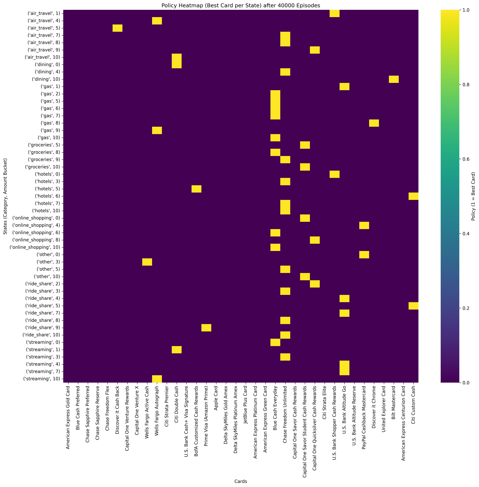
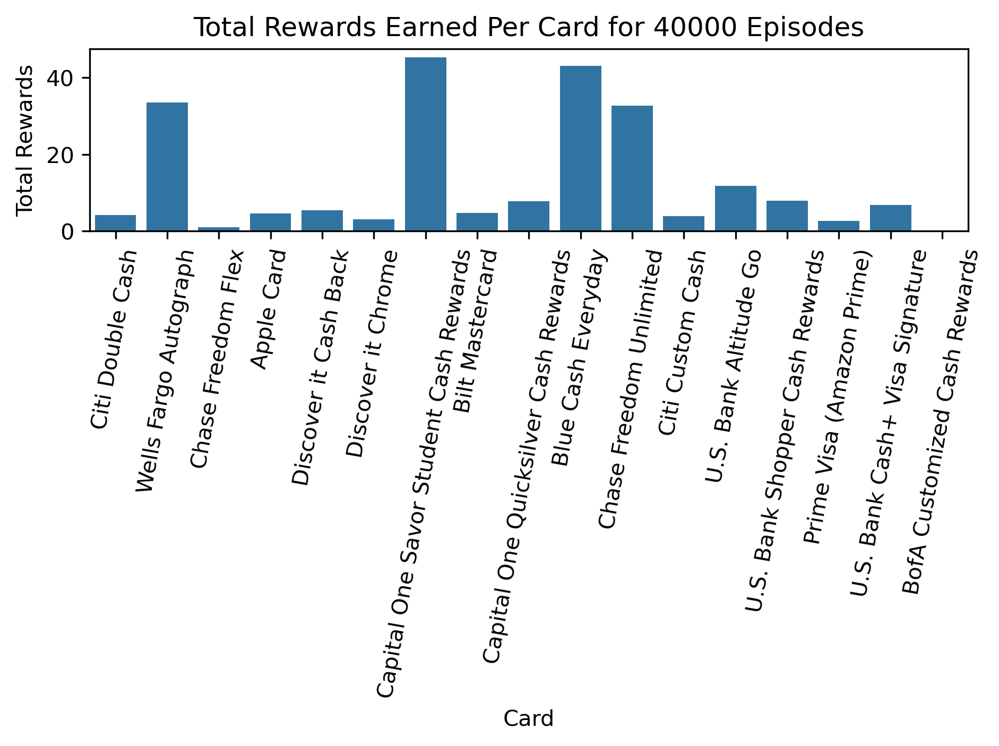

# Credit Card Reward Maximizer via Q-Learning

## Overview

In this project, we aim to maximize the rewards (cashback, points, or both) that a user can obtain from using a specific combination of credit cards in their daily life. Using Q-learning on a custom built reinforcement learning environment, our AI agent goes through the user's transactions and chooses the best credit card for each transaction in a Q-learning step. Using Gym discrete tuples of (category, amount\_bucket), the agent then determines the most optimal card for each category they spend in, taking the number of transactions and magnitude (transaction amount) into consideration. Over thousands of episodes, the agent converges on a realistic set of credit cards that the user can utilize to maximize their rewards without an overwhelming amount of credit cards and annual fees.

## Features

- **Q-Learning Reward Optimization**
  - Trains an agent to choose the best card for each transaction.
  - Uses reward mappings (ex. 4× dining, 3× gas) to compute reward value in US dollars and/or points.
  - Produces visualizations of training performance and learned policies.

- **Custom Gym Environment**
  - Models transactions, categories, reward structures, and episode progression over training.
  - Supports reproducible training and comparison across datasets.

- **Interactive GUI**
  - Allows users to test the trained agent on their own transactions and card dataset. Users can also specify number of episodes and reward type (cashback, points, both).
  - Displays recommended cards and expected rewards, as well as insights into their own spend.
  - Displays visualizations on reward progression, policy heatmaps, and rewards-per-card at end of training.

- **Data & Visualization Tools**
  - Scripts for plotting reward average curves, policy heatmaps, and reward summaries per card.

## Directory Structure

```
CS4100-Final-Project/
│
├── cc_optimizer_gym.py # Custom environment for reinforcement learning training
├── Q_learning.py # Q-learning training loop and policy generation
├── visualizations.py # Plots running reward averages, heatmaps, etc
├── gui.py # Simple Streamlit GUI for card optimization demos
│
├── credit_cards/ # Contains data on the 36 most popular cards in the U.S.
├── test_data/ # Fake transaction generator and a test dataset of transactions
├── policy_heatmaps/ # Saved policy visualizations
├── per_card_rewards/ # Saved reward summaries per card
├── running_averages/ # Saved running reward average graphs
│
└── requirements.txt # Project package requirements
```

## Getting Started

### Clone the Repository
```bash
git clone https://github.com/1aurendrury/CS4100-Final-Project.git
```

### Change into the Project Directory
```bash
cd CS4100-Final-Project
```

### Install the Project Dependencies
```bash
pip install -r requirements.txt
```

### Option 1: Run the Q-learning.py Script
```bash
python Q_learning.py \
    --cards credit_cards/cards.csv \
    --transactions test_data/fake_transactions.csv \
    --mode cashback \
    --episodes 5000
```

### Option 2: Run gui.py for an Interactive Training Experience
```bash
streamlit run gui.py
```

### Optional: Run visualizations.py to generate various plots for a set number of episodes
```bash
python visualizations.py
```

## Example Visualizations (40,000 Episodes)

<div align="center">
  
  
  
</div>

## Future Expansions
Despite the effectiveness of our project, some limitations and room for future expansion remain. Our current approach does not consider card credits and offers, such as the 7 US dollar monthly Dunkin credit for the American Express Gold Card. Furthermore, cards with rotating categories did not have said category multipliers factored in, and their base multipliers were used instead. We were also unable to add sign up bonuses to the evaluation process, as this number can vary from person to person. While our model can certainly be expanded to consider all of these factors, we were still able to create an effective and simple Q-learning agent that can give the user meaningful insights on their organic spend and help recommend cards that will maximize rewards on all of their categories.

## Collaborators
- Lauren Drury
- Tiffany Zhang
- Ethan Tang